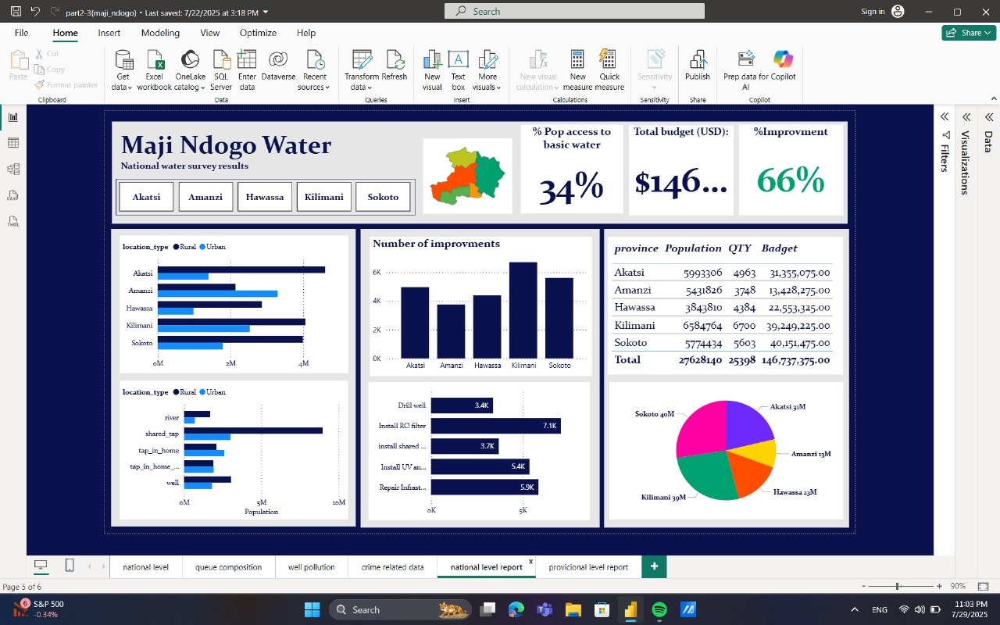
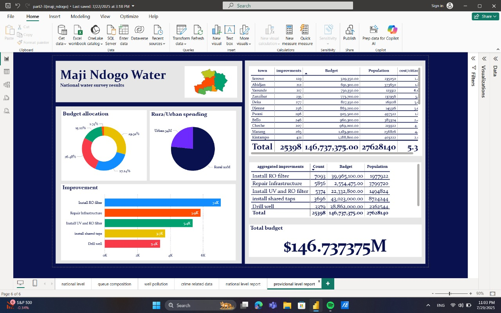

# Power BI Sprint – ALX: Maji Ndogo Dashboard (Part 3)

This is the third part of the ALX Power BI Sprint project for the fictional city **Maji Ndogo**. It focuses on budget allocation, project progress, and provincial comparison.

## Goals

- Compare budget per province  
- Track project completion status  
- Highlight discrepancies between employee records and auditor checks

## Report Pages

1. **National Level Report**  
   Budget overview, population served, project types.

2. **Provincial Level Report**  
   Deep dive per province – sources built, costs, and performance.

##  Techniques Used

- Budget tracking visuals  
- DAX: COUNTROWS, CALCULATE, net balance logic  
- Matrix visuals for summarizing progress  
- GeoJSON map for province mapping

---

##  Files in Repository
-  [Power BI Report (.pbix)](part2-3(maji_ndogo).pbix)
-  [Dataset (.csv)](Md_water_services_data.xlsx)
-  [GeoJSON Map](MD_Provinces.json)
-  [ALX Project Brief](Part3_Slides.pdf)
-  [Sprint Weekly Test](project-Maji-Ndogo-part-3-MCQ.pdf)

---

##  External Link

-LinkedIn project write-up:[www.linkedin.com/feed/update/urn:li:activity:7354059199359713280/]

---

##  Tools

- Power BI Desktop  
- Power Query  
- GeoJSON Map  
- CSV file 

---

## Report Screenshots

